# Investigation of OS Network Security with Raspberry Pi 3

*Evan Richard Computer Science Department
Missouri University of Science and Technology
Rolla, MO 65409
ecrb29@umsystem.edu*

*Christopher Elam
Computer Science Department
Missouri University of Science and Technology
Rolla, MO 65409
Cjefd4@umsystem.edu*

## Abstract 
**In this introductory experiment, we investigated vulnerabilities with wireless network security by simulating rogue access point (AP) attacks with a Raspberry Pi 3. We leveraged tools such as hostapd, dnsmasq, iptables, lighttpd, and Wifi-Pumpkin3 within a Debian-based environment to mimic open public Wi-Fi. Clients that connected to the rogue AP would be redirected to a credential phishing page via a captive portal, enabling the collection of login information and basic man-in-the-middle (MITM) exploration. This project aimed to explore how such attacks could be launched, to better understand security flaws in public Wi-Fi networks, and to research ways in which such attacks could be deterred.**

## I. INTRODUCTION

Public Wi-Fi offers a convenient way to access the internet from all types of places like airports, restaurants, libraries, and campuses. However, this comes at the cost of security. Many public networks are unsecure despite being in an area of high traffic, the most common place to find a rogue access point attack.

A rogue access point is a wireless network device that is connected to a network without authorization from the network administrators. A rogue AP can mimic a legitimate wireless network, entice users to connect, feigning “free Wi-Fi”, and even have devices connect to it that are actively searching for open networks. Connected users then become compromised and are at risk for several different types of attacks, like credential phishing and man-in-the-middle.

In this project we aimed to simulate this exact scenario with a basic setup which included a Raspberry Pi 3, a monitor to view activity on our AP, ethernet cables to have the Raspberry Pi 3 connected to ethernet, mouse and keyboard connections, a Raspberry Pi power supply, and a separate laptop to act as our “victim” connecting to the AP (see Fig. 1).

The goal of this entire process was to learn more about network security, how to take advantage of unsecured networks, and what preventative measures exist for these kinds of attacks, if any.

*Fig. 1. Raspberry Pi 3 Model B+ with HDMI connection to monitor, ethernet cable, keyboard/mouse cable, and power supply.*

## II. SETTING UP ROGUE AP

To begin with, we got a Raspberry Pi 3 Model B+ with a proper Raspberry Pi Power Supply. We got a 128GB microSD card, a 32GB microSD will also work. Next, we used a Windows computer and installed Raspberry Pi Imager, plugged in our microSD, chose Raspberry Pi 3 under device, chose Raspberry Pi OS (64-bit) for OS, and chose the microSD for storage. After the microSD was done, approximately 5 minutes later, we plugged it into the Raspberry Pi. After that, we connected a monitor via HDMI, a keyboard, a mouse, an Ethernet cable, and the power supply.

Upon turning on the Raspberry Pi, we first selected Ethernet as our internet connection. We then made an account, making sure to remember your password as you will be prompted for it later. This concludes all of the basic setup, and now we open the terminal to move on to setting up the rogue AP. For the first half of this experiment, we attempted to create our own rogue AP using only free software tools available to us.

An important note before beginning any of this is ensuring your Raspberry Pi has Ethernet and that you are not connected to Wi-Fi.

### A. Using Free Software Tools

To begin, we installed some important tools we would need for the AP to work using “sudo apt install hostapd dnsmasq iptables”. Dnsmasq provides DNS and DHCP services, allowing connected clients to receive IP addresses and resolve

domain names on the rogue network. Hostapd turns the wireless interface into an access point, broadcasting the SSID and handling authentication (or lack thereof for open networks). Iptables manage network traffic rules; used to redirect client requests (e.g., to the phishing page) and control packet flow for the attack setup.

We then need to fix the config file of hostapd using “sudo nano /etc/hostapd/hostapd.conf” for permissions (making sure we are at the root when doing this, as the files we installed will be under the etc directory). This is necessary to define how our rogue access point should behave—this includes setting parameters like the SSID name, wireless interface, channel, and security settings. (See Fig. 2)

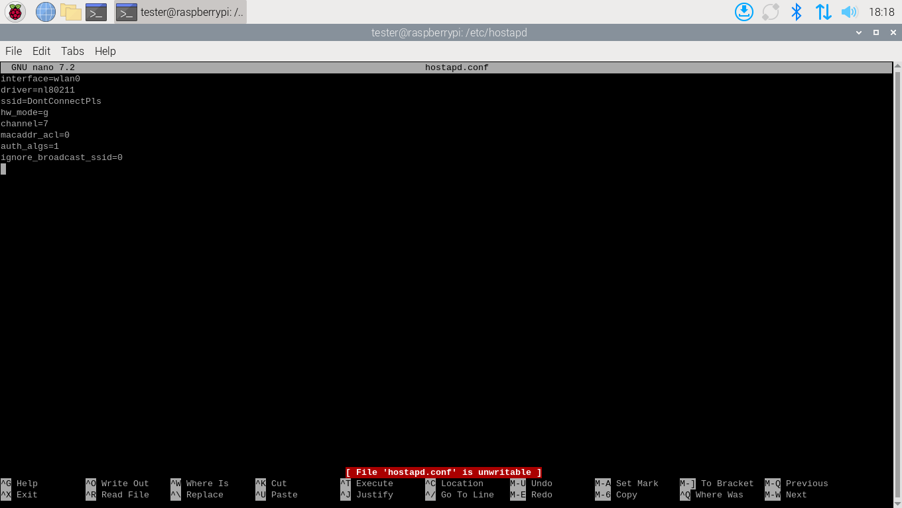

*Fig. 2. Shows hostapd.conf code.*

Next, direct the system to the location of our configuration file by executing “sudo nano /etc/default/hostapd” and add the line “DAEMON_CONF=/etc/hostapd/hostapd.conf”. This step ensures that hostapd is aware of the location of its configuration file as specified in the code. (See Fig. 3)

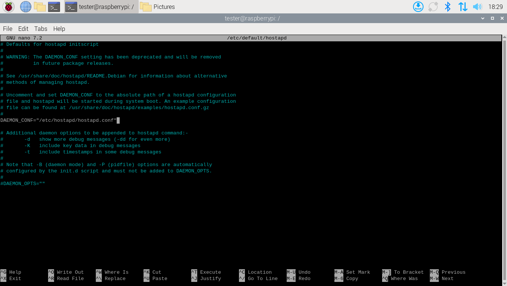

*Fig. 3. Shows hostapd code.*

Now we do the same thing except with dnsmasq. We do “sudo nano /etc/dnsmasq.conf” to open and get permissions to edit the file. This step is essential because dnsmasq is responsible for assigning IP addresses to clients that connect to our fake access point. The interface line specifies which wireless interface dnsmasq should listen on. The dhcp-range sets the pool of IP addresses that can be handed out to connected devices. Insert the following: (See Fig. 4)

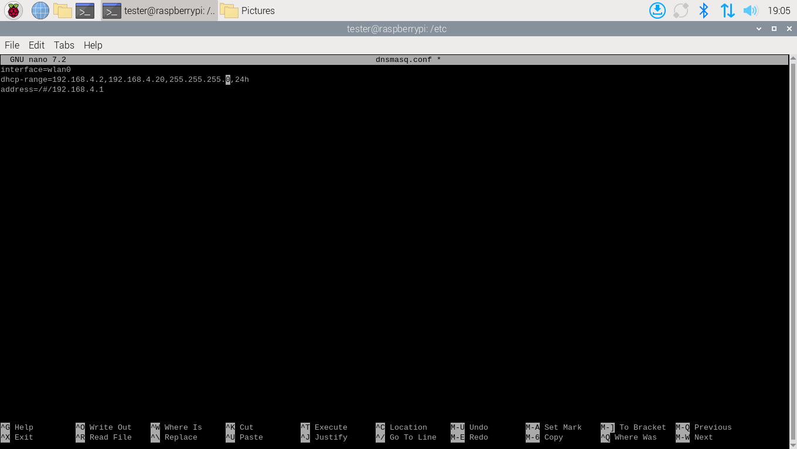

*Fig. 4. Shows dnsmasq.conf.*

Now that we have set the interface to wlan0, we need to give wlan0 a static IP. Wlan0 must have a fixed and predictable IP address so that dnsmasq can correctly hand out IPs. We open the dhcpcd’s config file with “sudo nano /etc/dhcpcd.conf”. Dhcpcd is a lightweight DHCP client used on Linux systems to automatically configure network interfaces. We add the following to the config file: (See Fig. 5)

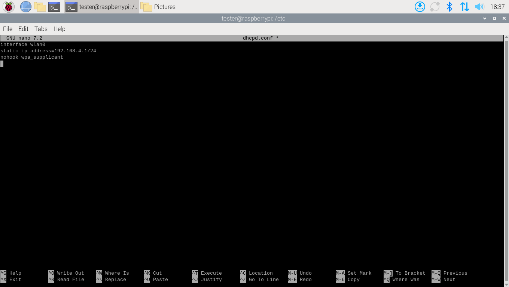

*Fig. 5. Shows dhcpd.conf code.*

Next, we enabled IP forwarding by running “sudo nano /etc/sysctl.conf”. We then uncomment the line “net.ipv4.ip_forward=1”. IP forwarding is a network setting that will allow our device to pass network traffic from one interface to another, acting like a router. (See Fig. 6)

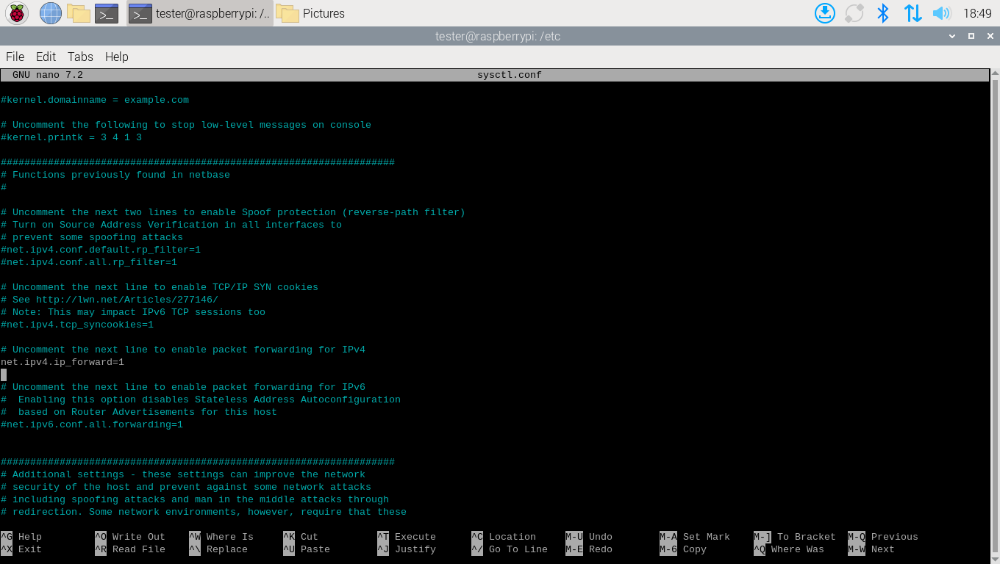

*Fig. 6. Shows sysctl.conf code.*

Lastly before starting we need to configure our iptables rules for NAT and redirection. This will allow client devices connected to the AP to share the internet with the Pi and intercept HTTP traffic. (See Fig 7)

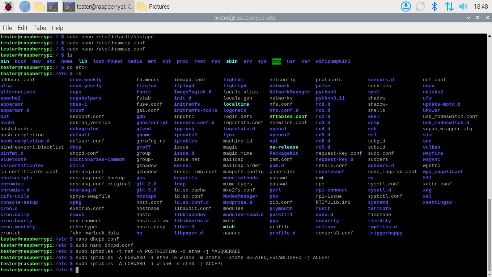

*Fig. 7. Shows iptables NAT and redirection terminal commands*

Last but not least, we start everything. (See Fig 8)

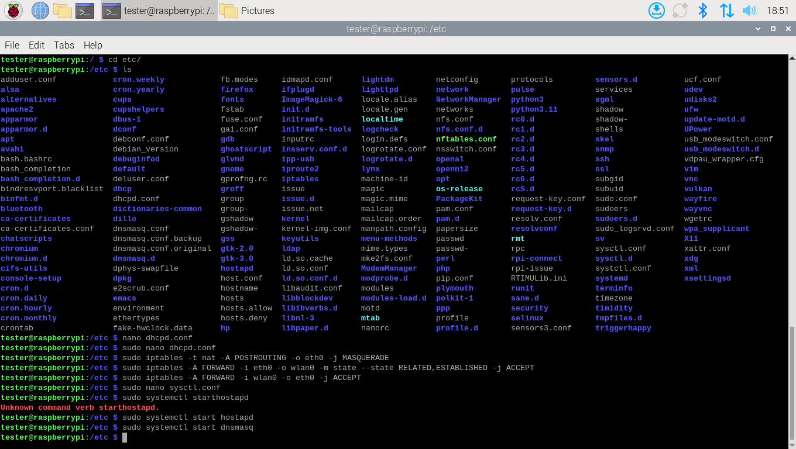

*Fig. 8. Shows terminal commands to start dnsmasq and hostapd.*

Common issues we ran into when setting up were “hostapd.service is masked”. This happens because when installing hostapd from a repo, it automatically starts as masked. To fix this, just unmask it “sudo systemctl unmask hostapd” and start again with “sudo systemctl status hostapd”. It is also important to note that to check the status of both hostapd and dnsmask, you can simply run the command “sudo systemctl status [insert name]” where insert name is either hostapd or dnsmasq. Another important command to know is

“iw dev”, this will display information about the wireless devices on the system. A good way to check if type is set to AP and if the ssid matches the one you used.

### B. Wifi-Pumpkin3 Repository

Wifi-Pumpkin3 is an open-source framework for rogue access point attack used widely for security research purposes and for reverse engineering.

Firstly, we will need to preinstall some tools that Wi-Fi pumpkin needs to operate properly with “sudo apt install git python3-pip python3-venv libssl-dev libffi-dev build-essential dnsmask hostapd iw net-tools -y”. Then we can clone the repository with “git clone https://github.com/P0cL4bs/wifipumpkin3.git” and “cd wifipumpkin3”. It is important, make sure to clone this at the root to avoid grievances later.

We can then setup a virtual environment with “python3 -m venv venv” and activate it with “source venv/bin/activate”. Finally, we will install some python requirements with “pip install –upgrade pip” and “pip install –break-system-packages -r requirements.txt”. You should now be in a virtual environment seeing (venv) at the beginning and all you need to do is return to the root where you cloned the repository and run “wifipumpkin3”. A message will appear to confirm a user configuration has been successfully made and then you can run the command “wifipumpkin3” one more time to launch (see Fig. 8).

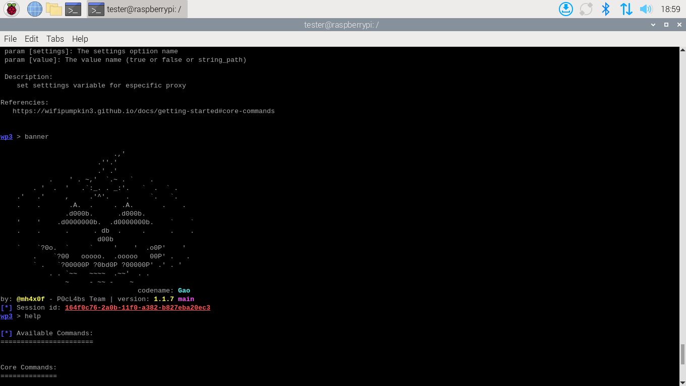

*Fig. 8. Wifi-Pumpkin3 Mascot that shows after running banner command.*

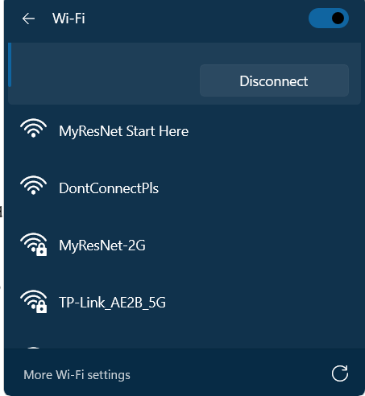

*Fig. 9. Shows DontConnectPls as an available Wi-Fi hotspot to connect to. This is the ssid of our rogue AP setup using free software.*

## III. RESULTS AND ANALYSIS

The first attack we tested was connecting our “victim’s” laptop to the rogue AP we created via free software. By using Wi-Fi passthrough we were able to have the client successfully connect to our AP, however probably due to a combination of having unqualified equipment and not much technical knowledge in the area we were not able to do much else with this version of the rogue AP besides get the IP and mac address of the person connected.

We experimented with another software tool called lighttpd. However, we were unsuccessful in this pursuit to create our own captive portal and instead ended up just running into a lot of debugging and issues with connecting the client to our custom-made webpage. If this had worked, the idea would’ve been that the victim would be led to a fake login page created by us to attempt to phish credentials.

Where things get more interesting is when we setup Wifi-Pumpkin3 and started a rogue AP. With basic commands like “set ssid [name]” you can customize your rogue AP any way you want. So for testing purposes we named it just like the one we were currently all connected to “MyResNet-5G”.

Upon starting our rogue AP we immediately tried connecting the “victim’s” laptop (See Fig. 12). Upon opening a browser the victim was brought to a login page and prompted to login. This works on both laptops and phones (See Fig. 10 and Fig. 11).

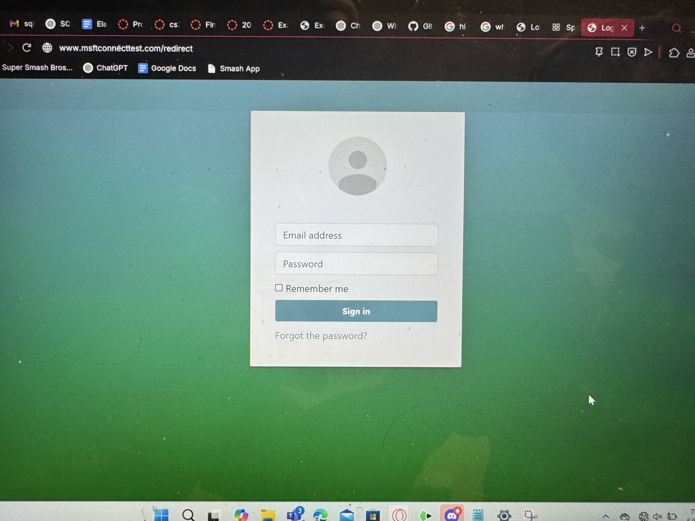

*Fig. 10. Shows a victim on a laptop brought onto a fake captive portal login page asking for login credentials.*

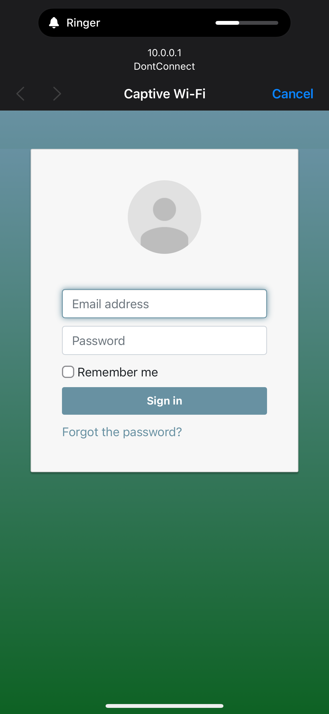

*Fig. 11. Shows a fake captive portal login page on iOS.*

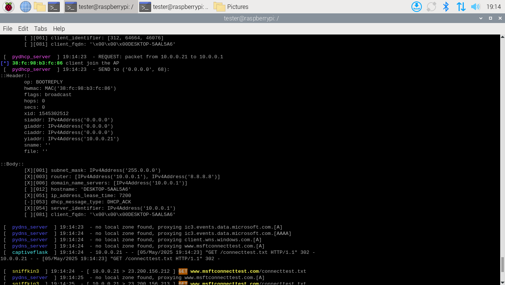

*Fig. 12. Shows notified of client joining AP along with some credentials.*

*Fig. 13. Shows captured login credentials from a login attempt.*

As seen above in Fig. 13, when the victim enters their login credentials or submits anything into the captive portal, we are sent back their information, and they are free to roam the internet. However, since they are connected to our AP, we can perform some MITM exploration as any sites they visit are recorded and sent to us on our open terminal.

When we configured our rogue access point to broadcast as “MyResNet-5G,” upon activation, an unexpected behavior was observed on the client device. For a brief moment, the device appeared to maintain its connection to the new ssid. However, it soon disconnected itself and showed as a newly labeled network titled “MyResNet-5G 2”. This change might indicate that the operating system detected a conflict between two networks broadcasting the same ssid and attempted to distinguish between them automatically. This behavior is likely due to the client device’s attempt to reconcile the conflict by assigning a distinct identifier in the Wi-Fi interface to avoid confusion, even though both ssids appeared identical from a name standpoint. This highlights an important security measure in modern operating systems: devices may use more than just the ssid (such as bssid/mac address) to determine whether a network is truly the same. It also demonstrates a limitation of rogue AP attacks using ssid spoofing alone, as many clients will not switch unless the signal strength is stronger or they are actively disconnected from the real AP.

## IV. CONCLUSION

In conclusion, our CS-3800 project, Investigation of OS Network Security with Raspberry Pi 3, gave us valuable insight into real-world network vulnerabilities and security practices. We successfully built a rogue access point, carried out credential phishing, and explored basic man-in-the-middle techniques. Along the way, we gained hands-on experience with key networking tools like dnsmasq, hostapd, lighttpd, dhcpcd, iptables, and more. While we had hoped to leverage Kali Linux more fully, our Raspberry Pi 3 lacked the necessary hardware compatibility to support many of Kali’s built-in modules. Despite that limitation, the project deepened our understanding of network security and the practical applications of open-source software.